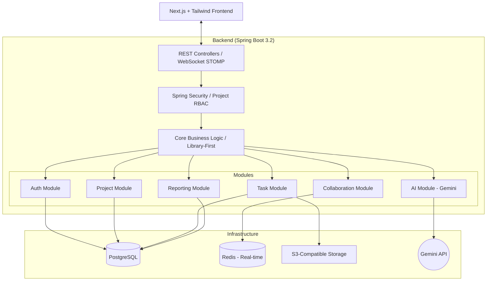

# TaskForge Architecture

## High-Level System Overview

TaskForge is designed with a modular "Library-First" architecture to minimize coordination overhead and ensure high maintainability.

## Module Definitions

| Module | Responsibility | Key Technologies |
|--------|----------------|------------------|
| **Auth** | User identity, Authentication, and Project-level RBAC. | Spring Security |
| **Project** | Workspace and Project lifecycle, Member management. | JPA / PostgreSQL |
| **Task** | Task CRUD, Subtask hierarchies, Progress rollup. | JPA / PostgreSQL |
| **Collaboration** | Task comments, @mentions, and real-time event broadcasting. | WebSockets (STOMP) / Redis |
| **AI Features** | Gemini API orchestration for subtasks and risk analysis. | Gemini SDK |
| **Reporting** | Dashboard analytics, CSV/PDF export logic. | Spring Batch / PDFBox |

## Data Flow & Integration
1. **Real-time Sync**: State changes in the Task module trigger events via the Collaboration module, which are pushed to the Frontend via WebSockets with <500ms latency.
2. **AI Assistance**: User requests for task breakdown are handled by the AI module, which fetches context from the Task module before calling Gemini.
3. **Security**: Every request is intercepted by the Security module to verify project-level permissions before reaching the core logic.
